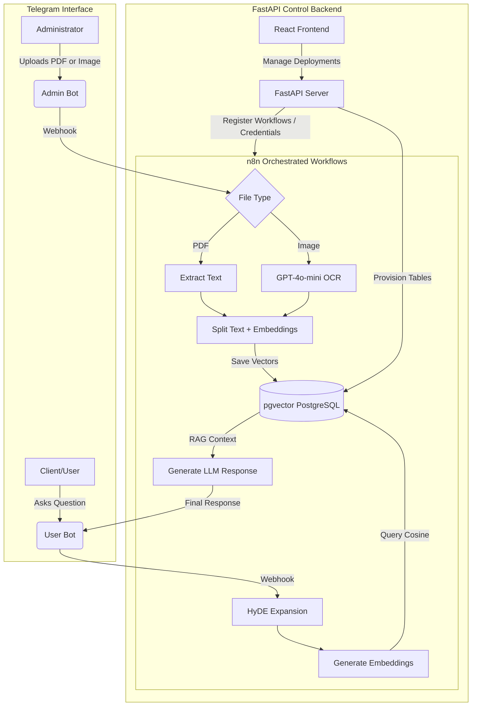

# AIOPSORA Bots

An enterprise-grade orchestration, deployment, and automated management platform for Intelligent Telegram Assistants with advanced RAG (Retrieval-Augmented Generation), HyDE (Hypothetical Document Embeddings), and smart document ingestion (OCR for images and PDF processing) integrated with n8n and FastAPI.

---

## Project Description

AIOPSORA Bots enables the creation of automated, dynamic deployments composed of a pair of Telegram bots (a User Query Bot and an Administration Ingestion Bot) that directly interact with a PostgreSQL vector database (pgvector) and OpenAI models. All visual orchestration logic is dynamically governed by n8n, provisioned and configured automatically via the central FastAPI API.

---

## Key Features

### 1. Bot Pairs per Deployment
Each deployment on the platform generates two complementary bots:
*   **User Query Bot (User Bot):**
    *   Designed to interactively and naturally answer queries from clients or end users.
    *   **HyDE (Hypothetical Document Embeddings):** Expands the user's initial query using a language model to inject additional technical keywords.
    *   **Vector Semantic Search:** Generates embeddings and queries PostgreSQL (pgvector) vector databases to retrieve the most relevant context.
    *   **Conversation Memory:** Automatically stores and dynamically injects the user's chat history into every interaction.
    *   **Dynamic Rules and Prompts:** Supports custom instructions and prompts injected directly by the administrator in real-time from the backend.
*   **Administration Ingestion Bot (Admin Bot):**
    *   Designed for administrators to feed knowledge to the user bot.
    *   **OCR Visual Processing (GPT-4o-mini):** If an image is sent, the bot visually analyzes its content and formally extracts structured information.
    *   **PDF Extraction:** Automatically extracts text from PDF documents using pdf-lib and pdf-parse.
    *   **Vector Database Indexing:** Splits text into overlapping chunks using recursive character splitters, generates embeddings with OpenAI's text-embedding-3-small, and indexes them automatically in dedicated vector tables per deployment (n8n_vectors_<safe_bot_id>).

### 2. Central FastAPI API
A robust backend interface built with FastAPI and SQLModel to handle the full lifecycle of the bots:
*   **Deployment (POST /deploy):** Registers credentials in n8n, initializes and activates specific Telegram workflows, and provisions dedicated vector databases.
*   **List (GET /deploy):** Lists and monitors all active deployments.
*   **Update (PUT /deploy/{id}/prompt):** Updates the custom instructions and behavior of the Query Bot in real-time.
*   **Absolute Cleanup (DELETE /deploy/{id}):** Deactivates workflows in n8n, deletes Telegram and OpenAI credentials from the instance, and physically drops the vector tables to ensure zero data waste.

### 3. Advanced Containerized Infrastructure
The environment is fully orchestrated using Docker Compose:
*   **db:** PostgreSQL 16 equipped with the pgvector extension for multidimensional embedding storage.
*   **n8n:** A customized n8n container (Dockerfile.n8n) with global npm packages pre-installed for dynamic document processing (pdf-lib, pdf-parse).
*   **ngrok:** A secure tunneling service to expose the local n8n instance to the internet for instantaneous webhook delivery from Telegram.
*   **backend:** The FastAPI web server exposing the orchestration API and managing the document database workflow.

---

## Technologies Used

*   **Core Backend:** Python 3.12, FastAPI, SQLModel, Uvicorn, PostgreSQL, pgvector, SQLAlchemy.
*   **Visual Orchestrator:** n8n (workflows built via dynamic Python code).
*   **AI Models:** OpenAI API (gpt-4o-mini and text-embedding-3-small).
*   **Frontend:** React, Vite, TailwindCSS.
*   **Infrastructure:** Docker & Docker Compose, Ngrok.

---

## Directory Structure

```bash
negocios-aiopsora-bots/
├── src/                        # Backend Logic (FastAPI)
│   ├── admin_workflow.py       # Admin Ingestion Bot workflow structure for n8n
│   ├── user_workflow.py        # User Query Bot workflow structure for n8n
│   ├── config.py               # Configuration singleton with Pydantic Settings
│   ├── credentials.py          # n8n credential registry manager for Telegram/OpenAI
│   ├── models.py               # SQLModel Database Models & Pydantic Validation Schemas
│   └── main.py                 # API endpoints & application lifespan
├── frontend/                   # Frontend Web Application (React + Vite)
├── Dockerfile                  # Dockerfile to compile and run the FastAPI Backend
├── Dockerfile.n8n              # Custom Dockerfile for n8n (with pdf-lib and pdf-parse)
├── docker-compose.yaml         # Containerized services orchestration
├── pyproject.toml              # Python project dependency definition (using uv)
├── uv.lock                     # Lockfile for deterministic Python dependencies
└── README.md                   # Main system documentation
```

---

## Quick Start Guide

### 1. Prerequisites
Ensure your development environment meets the following requirements:
*   Docker and Docker Compose installed.
*   An active OpenAI account and a valid API Key.
*   Two Telegram bot tokens created via @BotFather (one for admin ingestion, one for user queries).
*   A Ngrok account and authtoken for webhook tunneling.

### 2. Configure Environment Variables
Create a `.env` file in the root directory of the project with the following structure:

```env
# N8N Configuration
N8N_API_URL=http://n8n:5678/api/v1
N8N_API_KEY=your_n8n_api_key_here

# Database Configuration (PostgreSQL)
POSTGRES_USER=postgres
POSTGRES_PASSWORD=your_secure_password_here
POSTGRES_DB=n8n_db
DATABASE_URL=postgresql://postgres:your_secure_password_here@db:5432/n8n_db

# Ngrok Configuration (Webhook Telegram Tunneling)
NGROK_AUTHTOKEN=your_ngrok_authtoken
NGROK_DOMAIN=your_static_ngrok_subdomain.ngrok-free.app

# N8N Internal Encryption Key
N8N_ENCRYPTION_KEY=highly_secure_encryption_key
```

### 3. Spin Up the Infrastructure
Start all services in background mode using Compose:

```bash
docker-compose up -d --build
```

This will spin up the following services:
1.  **db:** PostgreSQL listening on port 5432.
2.  **n8n:** Accessible locally at http://localhost:5678.
3.  **ngrok:** Secure webhook tunnel created using NGROK_DOMAIN.
4.  **backend:** FastAPI API listening at http://localhost:8000.

---

## API Endpoints Reference

### Deploy a Bot Pair
*   **Endpoint:** `POST /deploy`
*   **Body:**
    ```json
    {
      "admin_token": "TELEGRAM_ADMIN_BOT_TOKEN",
      "user_token": "TELEGRAM_USER_BOT_TOKEN",
      "openai_api_key": "SK-OPENAI-API-KEY",
      "extra_prompt": "Optional behavior guidelines for the User Bot"
    }
    ```
*   **Response:** Returns direct links to the created Telegram bots and the generated deployment_id.

### List Active Deployments
*   **Endpoint:** `GET /deploy`
*   **Response:** A list of all active deployments containing their unique ID and bot usernames.

### Update Prompt of a Deployment
*   **Endpoint:** `PUT /deploy/{deployment_id}/prompt`
*   **Body:**
    ```json
    {
      "extra_prompt": "New behavioral guidelines for the User Bot."
    }
    ```

### Delete a Deployment
*   **Endpoint:** `DELETE /deploy/{deployment_id}`
*   **Response:** Cleanly deletes n8n resources, drops active credentials, and physically drops the vector tables.

---

## Conceptual Architecture



---

## License

This software is proprietary and confidential. Its use and distribution are strictly regulated. For more details, refer to the [LICENSE](file:///Users/danielgalindo/projects/UNI/negocios-aiopsora-bots/LICENSE) file.
