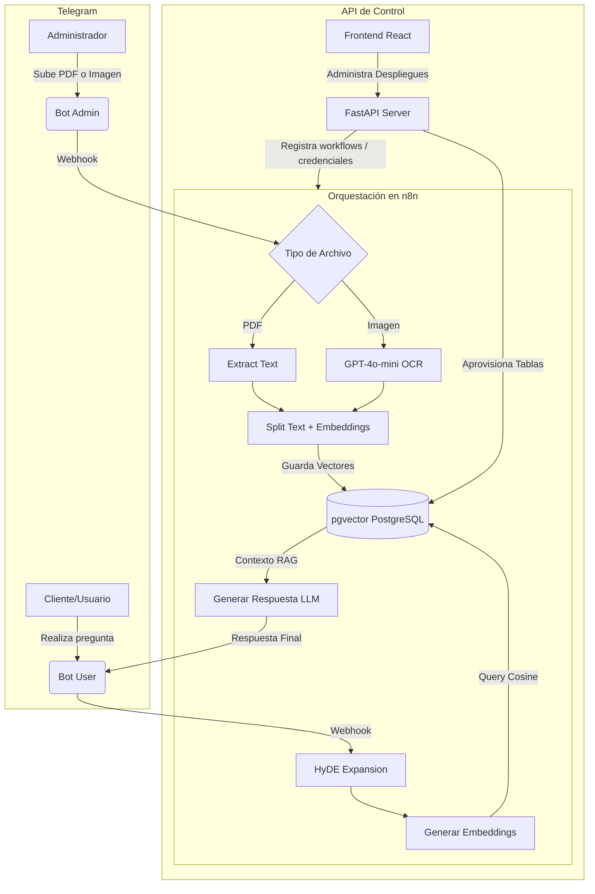

# AIOPSORA Bots

Plataforma empresarial de orquestación, despliegue y administración automatizada de Asistentes Inteligentes para Telegram con capacidades avanzadas de RAG (Retrieval-Augmented Generation), HyDE (Hypothetical Document Embeddings) e ingesta de documentos inteligente (OCR de imágenes y procesamiento de PDFs) integrada con n8n y FastAPI.

---

## Descripción del Proyecto

AIOPSORA Bots permite crear despliegues automatizados y dinámicos compuestos por una pareja de bots de Telegram (un Bot de Usuario/Consulta y un Bot de Administración/Ingesta) que interactúan directamente con una base de datos vectorial PostgreSQL (pgvector) y modelos de OpenAI. Toda la lógica de orquestación visual está gobernada dinámicamente por n8n, levantado y configurado automáticamente a través de la API central en FastAPI.

---

## Características Principales

### 1. Parejas de Bots por Despliegue
Cada despliegue en la plataforma genera dos bots complementarios:
*   **Bot de Consulta (User Bot):**
    *   Diseñado para responder de forma interactiva y natural a los clientes o usuarios finales.
    *   **HyDE (Hypothetical Document Embeddings):** Expande la consulta inicial del usuario utilizando un modelo de lenguaje para inyectar palabras clave técnicas adicionales.
    *   **Búsqueda Semántica Vectorial:** Genera embeddings y consulta bases de datos vectoriales en PostgreSQL (pgvector) para recuperar el contexto más relevante.
    *   **Memoria de Conversación:** Almacena e inyecta dinámicamente el historial de chat del usuario en cada interacción.
    *   **Reglas y Prompts Dinámicos:** Admite prompts e instrucciones inyectados directamente por el administrador de forma ágil desde el backend.
*   **Bot de Ingesta (Admin Bot):**
    *   Diseñado para que los administradores alimenten de conocimientos al bot de usuario.
    *   **Procesamiento OCR Visual (GPT-4o-mini):** Si se envía una imagen, el bot analiza visualmente su contenido y extrae información formal de forma profesional.
    *   **Extracción de PDF:** Extrae texto automáticamente de documentos en formato PDF mediante pdf-lib y pdf-parse.
    *   **Indexación en Base de Datos de Vectores:** Divide el texto en fragmentos solapados mediante separadores recursivos de caracteres, genera los embeddings con text-embedding-3-small de OpenAI y los indexa automáticamente en tablas vectoriales dedicadas por despliegue (n8n_vectors_<safe_bot_id>).

### 2. API Central en FastAPI
Una interfaz backend sumamente robusta construida con FastAPI y SQLModel para realizar operaciones completas del ciclo de vida de los bots:
*   **Despliegue (POST /deploy):** Registra credenciales en n8n, inicializa e inicia flujos específicos de telegram, y aprovisiona base de datos vectoriales dedicadas para la pareja de bots.
*   **Listado (GET /deploy):** Permite listar y monitorear todos los despliegues activos en la plataforma.
*   **Modificación (PUT /deploy/{id}/prompt):** Actualiza el comportamiento e instrucciones en tiempo real del Bot de Consulta.
*   **Limpieza Absoluta (DELETE /deploy/{id}):** Apaga los flujos en n8n, elimina credenciales de Telegram y OpenAI de la instancia, y destruye la tabla vectorial física de la base de datos para no dejar rastros de datos huérfanos.

### 3. Infraestructura Containerizada Avanzada
El entorno está completamente orquestado mediante Docker Compose:
*   **db:** PostgreSQL 16 provisto con la extensión pgvector para el almacenamiento de embeddings multidimensionales.
*   **n8n:** Contenedor n8n personalizado (Dockerfile.n8n) con paquetería npm global preinstalada para procesamiento dinámico de documentos (pdf-lib, pdf-parse).
*   **ngrok:** Servicio de túnel seguro para exponer la instancia local de n8n a internet de manera que reciba eventos de webhook de Telegram al instante.
*   **backend:** El servidor web FastAPI que expone la API de orquestación y gestiona el flujo de trabajo de la base de datos documental.

---

## Tecnologías Utilizadas

*   **Core Backend:** Python 3.12, FastAPI, SQLModel, Uvicorn, PostgreSQL, pgvector, SQLAlchemy.
*   **Orquestador Visual:** n8n (flujos construidos mediante código Python dinámico).
*   **Modelos de IA:** OpenAI API (gpt-4o-mini y text-embedding-3-small).
*   **Frontend:** React, Vite, TailwindCSS.
*   **Infraestructura:** Docker & Docker Compose, Ngrok.

---

## Estructura del Directorio

```bash
negocios-aiopsora-bots/
├── src/                        # Lógica Backend (FastAPI)
│   ├── admin_workflow.py       # Estructura del flujo del Bot de Ingesta para n8n
│   ├── user_workflow.py        # Estructura del flujo del Bot de Consulta para n8n
│   ├── config.py               # Singleton de configuración con Pydantic Settings
│   ├── credentials.py          # Gestión y registro de credenciales de Telegram/OpenAI en n8n
│   ├── models.py               # Modelos SQLModel (BD) y esquemas Pydantic (Validaciones)
│   └── main.py                 # Endpoints de la API y Lifespan del servidor
├── frontend/                   # Aplicación Web Frontend (React + Vite)
├── Dockerfile                  # Dockerfile para compilar e iniciar el Backend FastAPI
├── Dockerfile.n8n              # Dockerfile personalizado para n8n (con pdf-lib y pdf-parse)
├── docker-compose.yaml         # Orquestación de servicios en contenedores locales
├── pyproject.toml              # Definición de dependencias del proyecto de Python (con uv)
├── uv.lock                     # Lockfile para dependencias deterministas de Python
└── README.md                   # Documentación principal del sistema
```

---

## Guía de Inicio Rápido

### 1. Requisitos Previos
Asegúrate de contar con lo siguiente en tu máquina:
*   Docker y Docker Compose instalados.
*   Una cuenta activa de OpenAI y un API Key válido.
*   Dos tokens de bot de Telegram creados mediante @BotFather (uno para uso del administrador y otro para uso del cliente).
*   Una cuenta de Ngrok y un authtoken para la tunelización.

### 2. Configurar Variables de Entorno
Crea un archivo `.env` en el directorio raíz del proyecto con la siguiente estructura:

```env
# Configuración de N8N
N8N_API_URL=http://n8n:5678/api/v1
N8N_API_KEY=tu_n8n_api_key_aqui

# Configuración de Base de Datos (PostgreSQL)
POSTGRES_USER=postgres
POSTGRES_PASSWORD=mi_clave_segura_aqui
POSTGRES_DB=n8n_db
DATABASE_URL=postgresql://postgres:mi_clave_segura_aqui@db:5432/n8n_db

# Configuración de Ngrok (Webhook Telegram Tunneling)
NGROK_AUTHTOKEN=tu_authtoken_de_ngrok
NGROK_DOMAIN=tu_subdominio_estatico_de_ngrok.ngrok-free.app

# Clave de encriptación interna de n8n
N8N_ENCRYPTION_KEY=clave_secreta_altamente_segura
```

### 3. Levantar la Infraestructura
Inicia todos los contenedores en segundo plano mediante Compose:

```bash
docker-compose up -d --build
```

Esto levantará los siguientes servicios:
1.  **db:** PostgreSQL escuchando en el puerto 5432.
2.  **n8n:** Accesible localmente en http://localhost:5678.
3.  **ngrok:** Genera un webhook túnel seguro a la URL configurada en NGROK_DOMAIN.
4.  **backend:** API en FastAPI escuchando en http://localhost:8000.

---

## Referencia de Endpoints API

### Desplegar una Pareja de Bots
*   **Endpoint:** `POST /deploy`
*   **Body:**
    ```json
    {
      "admin_token": "TOKEN_TELEGRAM_BOT_ADMIN",
      "user_token": "TOKEN_TELEGRAM_BOT_USER",
      "openai_api_key": "SK-OPENAI-API-KEY",
      "extra_prompt": "Instrucciones de comportamiento adicionales para el bot de usuario"
    }
    ```
*   **Respuesta:** Retorna el enlace directo a los bots en Telegram y el deployment_id generado.

### Listar Despliegues Activos
*   **Endpoint:** `GET /deploy`
*   **Respuesta:** Una lista de todos los despliegues que contiene su identificador único y los nombres de usuario de los bots de Telegram.

### Actualizar Prompt de un Despliegue
*   **Endpoint:** `PUT /deploy/{deployment_id}/prompt`
*   **Body:**
    ```json
    {
      "extra_prompt": "Nueva directriz de comportamiento para responder con un estilo diferente."
    }
    ```

### Eliminar un Despliegue
*   **Endpoint:** `DELETE /deploy/{deployment_id}`
*   **Respuesta:** Elimina completamente los recursos de n8n, borra las credenciales vinculadas y destruye la tabla vectorial correspondiente.

---

## Arquitectura Conceptual



---

## Licencia

Este desarrollo es de propiedad privada y confidencial. Su uso y distribución están estrictamente regulados. Para más detalles, consulte el archivo [LICENSE](file:///Users/danielgalindo/projects/UNI/negocios-aiopsora-bots/LICENSE).

